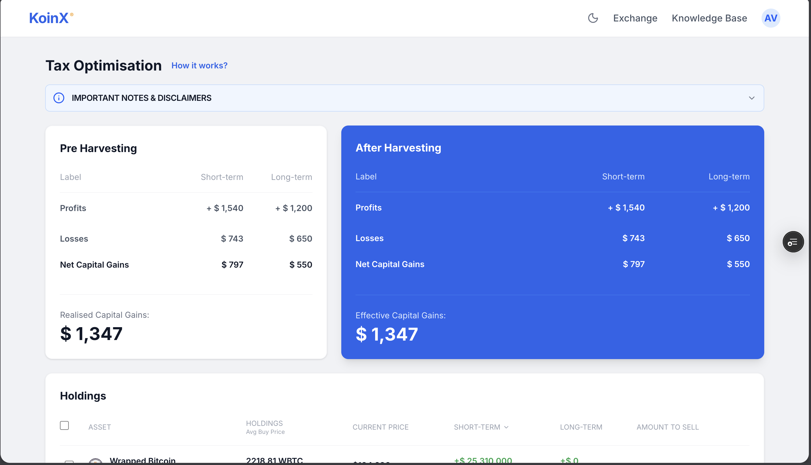
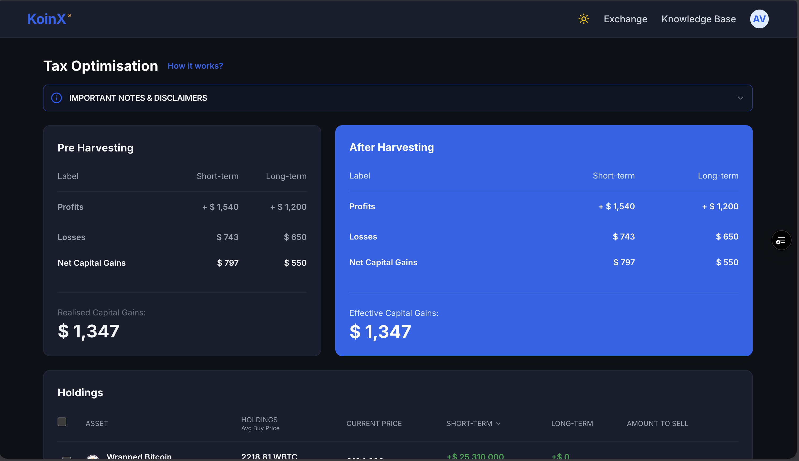
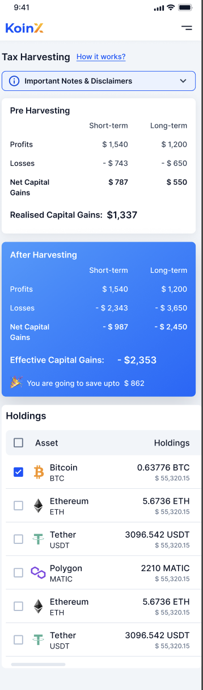

# KoinX Tax Optimisation Dashboard

A high-performance, mobile-responsive cryptocurrency tax-loss harvesting dashboard built for KoinX. This application allows users to identify "Short-term Capital Loss" opportunities in their portfolio to offset gains and save on taxes.

### 🚀 [Live Demo](https://tax-loss-harvesting-dusky.vercel.app/)

---

## ✨ Features

- **Tax-Loss Harvesting Engine**: Real-time calculation of tax savings based on selected assets.
- **Interactive Holdings Table**: Sortable, selectable, and searchable asset list with detailed loss/gain breakdown.
- **Mobile-First Design**: Fully responsive layout with custom horizontal scrolling for data-heavy tables.
- **Dual Theme Support**: Premium Light and Dark modes with system preference detection.
- **Rich Visuals**: Integrated high-quality cryptocurrency logos and modern iconography (Lucide React).
- **Smooth Animations**: Glassmorphism effects and micro-interactions powered by Tailwind CSS v4.

---

## 🛠 Setup Instructions

To run this project locally, follow these steps:

1. **Clone the repository**:
   ```bash
   git clone https://github.com/Adarsh-code169/Tax-Loss-Harvesting.git
   cd Tax-Loss-Harvesting
   ```

2. **Install dependencies**:
   ```bash
   npm install
   ```

3. **Start the development server**:
   ```bash
   npm run dev
   ```

4. **Build for production**:
   ```bash
   npm run build
   ```

---

## 🧠 Assumptions & Technical Details

During development, the following assumptions were made:

- **Tax Calculation Basis**: 
  - **Short-term Capital Gains (STCG)** are calculated for assets held < 1 year.
  - **Long-term Capital Gains (LTCG)** are calculated for assets held > 1 year.
  - Indian tax regulations (as of 2024) were used as a baseline for the logic, though the dashboard is flexible for global use.
- **Cost Basis**: Assumes a **FIFO (First-In, First-Out)** method for calculating gains and losses across multiple buy orders of the same asset.
- **Market Data**: Prices are currently managed via a mock API layer (`src/api`), simulating a real-world response from a provider like CoinGecko.
- **Wash Sale Rules**: The dashboard identifies purely technical loss positions and assumes the user is aware of their local "Wash Sale" or "Bed & Breakfast" rules regarding immediate buy-backs.

---

## 📸 Screenshots

### Desktop Views
| Light Mode | Dark Mode |
| :--- | :--- |
|  |  |

### Mobile View
| Mobile Dashboard |
| :--- |
|  |

---

## 🔧 Built With

- **React 18**
- **Vite** (Optimized build tool)
- **Tailwind CSS v4** (Modern styling system)
- **Lucide React** (Icons)
- **Vercel** (Deployment)

---

Developed with ❤️ for KoinX.
